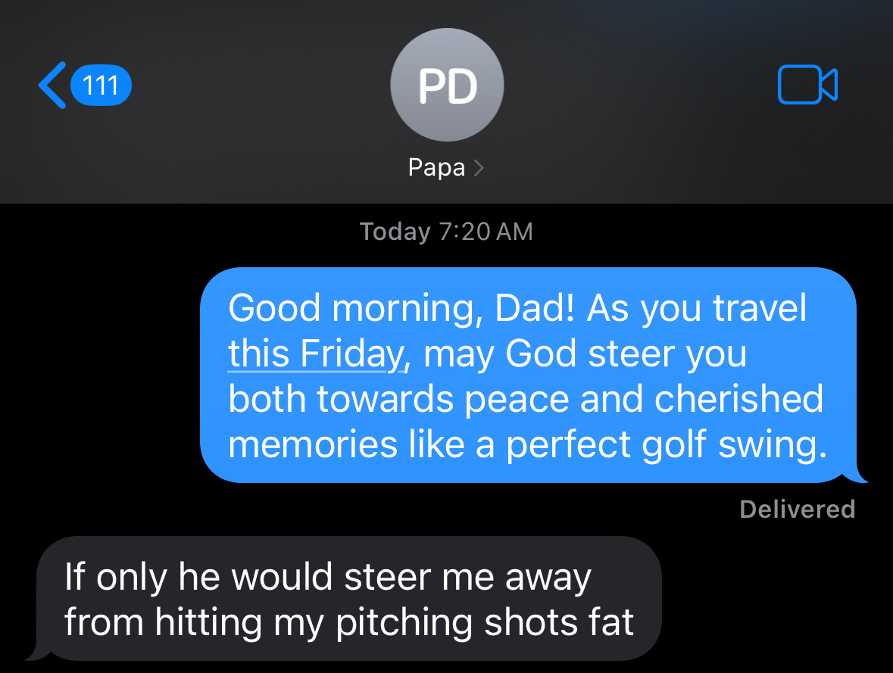

# Awesome Friend


## Overview

Awesome Friend is a Node.js program that generates and sends personalized good morning text messages to your contacts. These messages are crafted to have a tone of gratitude and surrender toward God, making them perfect for warm inspirations and encouragement, but feel free to change it to whatever you like by adjusting the chatGPT prompt. The program uses the macOS Messages app to send messages from your Mac to your iPhone contacts.

## Prerequisites

ℹ️ Before you can use Awesome Friend, make sure you have the following prerequisites:

1. A Mac computer with macOS installed.
2. An iPhone connected to your Mac.
3. Node.js and npm (Node Package Manager) installed on your Mac.
4. An OpenAI ChatGPT API key. If you don't have one, you can get it by signing up [here](https://platform.openai.com/signup/).

## ChatGPT Model

The default ChatGPT model used in Awesome Friend is `gpt-4-1106-preview`. However, due to limited availability, you may need to use a different model like `gpt-3.5-turbo` for your API key.

To change the model, follow these steps:

1. Open the `good-morning.js` file in your project directory.
2. Locate the following line of code in the `generateMessages` function:
   ```javascript
   model: 'gpt-4-1106-preview',
   ```
3. Replace `gpt-4-1106-preview` with `gpt-3.5-turbo` or any other available model name that corresponds to your API key.
    ```javascipt
    model: 'gpt-3.5-turbo',
    ```
Now you're using the specified model for generating messages.

**Note:** Ensure that the model you choose is compatible with your OpenAI API key. Some keys may only work with specific models.

## Setup

Follow these simple steps to set up and run Awesome Friend:

1. Clone the Awesome Friend repository to your local machine:
   ```bash
   git clone https://github.com/your-username/awesome-friend.git
   cd awesome-friend
   ```
2. Install the required dependencies:
   ```bash
   npm install
   ```
3. Navigate to the .env file in the project directory and add your OpenAI API key:
    ```bash
    OPENAI_API=your-openai-api-key
    ```
4. Add your contacts to the contacts.json file. **Note:** Contacts must have an iPhone
5. Run the program:
    ```bash
    npm start
    ```

Awesome Friend will generate personalized good morning messages for each contact and send them via the macOS Messages app to your iPhone contacts.

## Contributing
We welcome contributions to make Awesome Friend even better! Before contributing, please review our Code of Conduct:

### Code of Conduct
1. Be respectful: Treat all contributors and users with respect and kindness.
2. Be inclusive: We welcome contributors from all backgrounds and experiences.
3. Be collaborative: Work together with others in a constructive manner.
4. Be patient: Not everyone may have the same level of expertise, so be patient and helpful.
5. Report issues: If you encounter any issues or problems, please report them through the issue tracker.

*By following these guidelines, we aim to create a friendly and welcoming environment for all contributors.*

Feel free to submit bug reports, feature requests, or even pull requests to improve the program. Together, we can make Awesome Friend even more awesome!

## License

This project is licensed under the MIT License - see the [LICENSE](LICENSE) file for details.